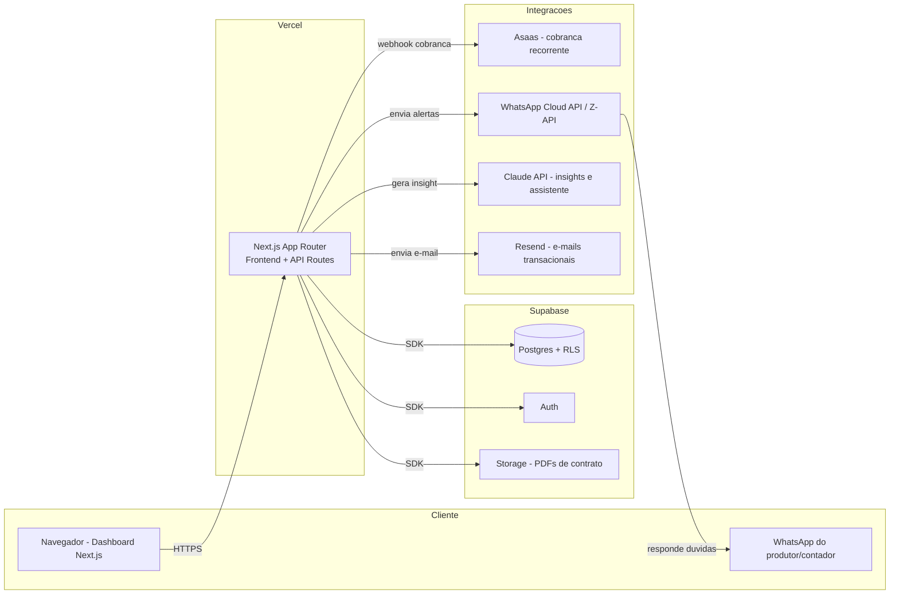

# Arquitetura Técnica — SafraCerta (Painel de Custo, Contrato e Fiscal para o Agro)

> Especificação técnica do SaaS escolhido no [`plano-monetizacao-saas.md`](../plano-monetizacao-saas.md). Este documento é a referência para começar a implementação: arquitetura, estrutura de pastas, prompt de IA, banco de dados, endpoints, fluxos, wireframes, modelo comercial e plano de vendas.

---

## 1. Arquitetura



**Princípios de arquitetura:**
- **Multi-tenant por linha (RLS):** cada fazenda/conta pertence a um `account_id`; políticas de Row Level Security no Postgres impedem que um cliente veja dado de outro, mesmo com bug de aplicação.
- **Monólito modular:** um único app Next.js com módulos (`custos`, `contratos`, `fiscal`, `alertas`) — evita overhead de microsserviços para uma operação de 1 pessoa nos primeiros 12 meses.
- **Automatizações fora do request-response:** alertas de WhatsApp e e-mails disparados por jobs agendados (Vercel Cron ou Supabase Edge Functions), não bloqueando a navegação do usuário.

---

## 2. Estrutura de pastas

```
safracerta/
├── app/
│   ├── (marketing)/                 # landing page publica
│   │   └── page.tsx
│   ├── (app)/                       # area logada
│   │   ├── layout.tsx               # sidebar + guarda de autenticacao
│   │   ├── dashboard/
│   │   │   └── page.tsx
│   │   ├── fazendas/
│   │   │   ├── page.tsx
│   │   │   └── [fazendaId]/page.tsx
│   │   ├── custos/
│   │   │   ├── page.tsx             # lista de lancamentos
│   │   │   └── novo/page.tsx        # formulario de lancamento
│   │   ├── break-even/
│   │   │   └── page.tsx
│   │   ├── contratos/
│   │   │   ├── page.tsx
│   │   │   └── [contratoId]/page.tsx
│   │   ├── fiscal/
│   │   │   └── page.tsx             # busca CST/cClassTrib/cBenef
│   │   ├── configuracoes/
│   │   │   └── plano/page.tsx       # assinatura, faturas
│   │   └── admin/                   # painel interno (so voce)
│   │       └── clientes/page.tsx
│   ├── api/
│   │   ├── custos/route.ts
│   │   ├── fazendas/route.ts
│   │   ├── contratos/route.ts
│   │   ├── contratos/[id]/pdf/route.ts
│   │   ├── dashboard/resumo/route.ts
│   │   ├── insights/route.ts        # chamada a Claude API
│   │   ├── webhooks/asaas/route.ts
│   │   └── webhooks/whatsapp/route.ts
│   └── layout.tsx
├── components/
│   ├── ui/                          # botoes, cards, inputs (design system)
│   ├── charts/                      # graficos do dashboard
│   └── forms/
├── lib/
│   ├── supabase/
│   │   ├── client.ts
│   │   └── server.ts
│   ├── asaas.ts
│   ├── whatsapp.ts
│   ├── claude.ts
│   └── calculos/
│       ├── custoPorHectare.ts
│       └── breakEven.ts
├── supabase/
│   ├── migrations/
│   └── seed.sql
├── jobs/
│   ├── enviarAlertasVencimento.ts   # roda via cron diario
│   └── lembreteFechamentoMensal.ts
├── public/
└── package.json
```

---

## 3. Prompt de IA

Dois usos de IA no produto: **(a)** gerar um resumo em linguagem natural dos números do dashboard, e **(b)** o assistente de WhatsApp (evolução futura, item 4 do plano). Prompt-base para ambos:

```
Você é o assistente financeiro do SafraCerta, um painel de custo agrícola
para produtores rurais e escritórios contábeis do agronegócio no Brasil,
com foco em soja, milho e feijão.

Regras:
- Responda sempre em português do Brasil, tom direto e prático, como um
  consultor de confiança falando com um produtor rural — sem jargão
  desnecessário.
- Baseie-se exclusivamente nos dados fornecidos no contexto (lançamentos de
  custo, safra, área em hectares, produtividade esperada). Nunca invente
  números.
- Quando os dados forem insuficientes para responder com precisão, diga
  isso claramente e explique qual informação falta.
- Ao comentar custo por hectare ou break-even, sempre traga o número em
  R$/ha e, quando possível, em R$/saca.
- Não dê recomendação de compra/venda de commodities nem aconselhamento
  fiscal/jurídico definitivo — para esses casos, oriente o usuário a
  confirmar com um consultor humano (a Consultoria Mendonça).
- Seja conciso: no WhatsApp, respostas de no máximo 5 linhas, a menos que
  o usuário peça detalhamento.

Contexto disponível nesta chamada:
{{dados_da_fazenda_em_json}}

Pergunta ou solicitação do usuário:
{{mensagem_do_usuario}}
```

---

## 4. Banco de dados (Supabase / Postgres)

```sql
create table accounts (
  id uuid primary key default gen_random_uuid(),
  nome text not null,
  plano text not null default 'starter', -- starter | pro | cerealista
  created_at timestamptz not null default now()
);

create table users (
  id uuid primary key references auth.users(id),
  account_id uuid not null references accounts(id),
  nome text,
  papel text not null default 'owner' -- owner | membro
);

create table fazendas (
  id uuid primary key default gen_random_uuid(),
  account_id uuid not null references accounts(id),
  nome text not null,
  municipio text,
  uf text,
  area_total_ha numeric,
  created_at timestamptz not null default now()
);

create table safras (
  id uuid primary key default gen_random_uuid(),
  fazenda_id uuid not null references fazendas(id),
  cultura text not null,        -- soja | milho | feijao
  ano text not null,            -- ex: 2025/2026
  area_plantada_ha numeric not null,
  produtividade_esperada_sc_ha numeric
);

create table categorias_custo (
  id uuid primary key default gen_random_uuid(),
  account_id uuid not null references accounts(id),
  nome text not null,           -- insumo, mao de obra, maquinario, arrendamento...
  grupo text                    -- custo variavel | custo fixo
);

create table lancamentos_custo (
  id uuid primary key default gen_random_uuid(),
  safra_id uuid not null references safras(id),
  categoria_id uuid not null references categorias_custo(id),
  descricao text,
  valor numeric not null,
  data date not null default current_date,
  created_by uuid references users(id),
  created_at timestamptz not null default now()
);

create table contratos (
  id uuid primary key default gen_random_uuid(),
  account_id uuid not null references accounts(id),
  fazenda_id uuid references fazendas(id),
  tipo text not null,           -- arrendamento | parceria
  contraparte_nome text not null,
  area_ha numeric,
  data_inicio date not null,
  data_fim date not null,
  forma_pagamento text,         -- sacas_por_ha | valor_fixo | percentual_producao
  valor_referencia numeric,
  status text not null default 'ativo',
  pdf_url text,
  created_at timestamptz not null default now()
);

create table alertas (
  id uuid primary key default gen_random_uuid(),
  account_id uuid not null references accounts(id),
  tipo text not null,           -- vencimento_contrato | fechamento_mensal | fiscal
  referencia_id uuid,
  enviar_em date not null,
  enviado boolean not null default false,
  canal text not null default 'whatsapp'
);

create table assinaturas (
  id uuid primary key default gen_random_uuid(),
  account_id uuid not null references accounts(id),
  asaas_subscription_id text,
  plano text not null,
  status text not null,         -- ativa | atrasada | cancelada
  proxima_cobranca date
);

-- Row Level Security: cada conta so ve seus proprios dados
alter table fazendas enable row level security;
create policy "fazendas por account" on fazendas
  using (account_id = (select account_id from users where id = auth.uid()));
-- (repetir policy equivalente para safras, categorias_custo, lancamentos_custo,
--  contratos, alertas e assinaturas, sempre filtrando por account_id)
```

---

## 5. Endpoints

| Método | Rota | Descrição |
|---|---|---|
| `POST` | `/api/fazendas` | Cria fazenda |
| `GET` | `/api/fazendas` | Lista fazendas da conta logada |
| `POST` | `/api/custos` | Registra lançamento de custo |
| `GET` | `/api/custos?safraId=` | Lista lançamentos de uma safra |
| `GET` | `/api/dashboard/resumo?fazendaId=` | Agregados: custo/ha, custo/saca, evolução mensal |
| `POST` | `/api/contratos` | Cria contrato |
| `GET` | `/api/contratos/:id/pdf` | Gera/retorna PDF do contrato |
| `POST` | `/api/insights` | Chama a Claude API com o prompt da seção 3 |
| `POST` | `/api/webhooks/asaas` | Recebe confirmação/cancelamento de cobrança |
| `POST` | `/api/webhooks/whatsapp` | Recebe mensagens do assistente via WhatsApp |

---

## 6. Fluxos principais

1. **Onboarding:** cadastro → criação da conta (`accounts`) → cadastro da 1ª fazenda → cadastro da safra atual → tela de "adicione seu primeiro custo" (evita dashboard vazio).
2. **Lançamento recorrente de custo:** produtor (ou o próprio consultor, no início) lança custos semanalmente; job diário verifica contas sem lançamento há 15+ dias e dispara lembrete via WhatsApp.
3. **Fechamento mensal:** no dia 1 de cada mês, job gera resumo do mês anterior e envia (WhatsApp/e-mail) com o insight gerado pela Claude API.
4. **Vencimento de contrato:** job diário verifica `contratos.data_fim` nos próximos 30/15/7 dias e dispara alerta.
5. **Cobrança:** Asaas gera cobrança recorrente → webhook atualiza `assinaturas.status` → acesso é bloqueado automaticamente se `atrasada` por mais de X dias.

---

## 7. Wireframes (descrição textual das telas-chave)

- **Dashboard:** topo com seletor de fazenda/safra; 4 cards de indicador (custo total, custo/ha, custo/saca, break-even); abaixo, gráfico de evolução mensal e gráfico de comparação entre talhões/fazendas; lateral com "insight do mês" gerado por IA.
- **Lançamento de custo:** formulário simples — safra (pré-selecionada), categoria (dropdown), descrição, valor, data; lista dos últimos lançamentos logo abaixo para conferência rápida.
- **Contratos:** lista em formato de cards com contraparte, área, vencimento e status (ativo/vencendo/vencido em cores); botão "novo contrato" abre formulário guiado que gera o PDF ao final.
- **Fiscal (fase 2):** campo de busca por NCM ou nome do produto → retorna CST, cClassTrib e cBenef aplicáveis, com changelog de quando cada tabela foi atualizada.
- **Configurações/Plano:** plano atual, próxima cobrança, histórico de faturas, botão de upgrade.

---

## 8. Modelo comercial

| Plano | Preço | Inclui |
|---|---|---|
| **Starter** | R$ 97/mês | 1 fazenda, dashboard de custos + break-even |
| **Pro** | R$ 297/mês | Até 5 fazendas, + módulo de contratos e alertas WhatsApp |
| **Cerealista/Escritório** | R$ 697–997/mês | Multi-cliente (várias contas gerenciadas), módulo fiscal, suporte prioritário |

Setup opcional de migração de dados (planilha antiga → SafraCerta): R$ 150–300, cobrança única — reaproveita o público que já tem a planilha de custos.

---

## 9. Plano de vendas

1. **Onda 1 — base instalada (semana 5–6):** os ~compradores atuais da planilha de custos (R$ 97), do modelo de contrato (R$ 67) e do Kit fiscal (R$ 197) recebem convite direto via e-mail/WhatsApp para o beta gratuito de 30 dias.
2. **Onda 2 — carteira de consultoria (semana 6–8):** clientes atuais de parametrização SIAGRI e suporte mensal (já pagam R$ 900+/mês por serviço) recebem o SafraCerta como complemento, reforçando o relacionamento.
3. **Onda 3 — inbound via blog (contínuo):** os artigos já publicados (NFP-e, cBenef, Reforma Tributária) recebem um CTA para o SafraCerta, capturando quem já chega buscando conteúdo fiscal do agro.
4. **Onda 4 — prospecção ativa (semana 11+):** grupos de WhatsApp/Facebook de produtores de Itaberaí e região, contato direto com armazéns/cerealistas para o módulo de contratos e, depois, indicadores.
5. **Onda 5 — parcerias (mês 4+):** escritórios de contabilidade rural e revendas de insumos como canal de indicação, com comissão recorrente (10–20% do primeiro ano) por cliente indicado.
